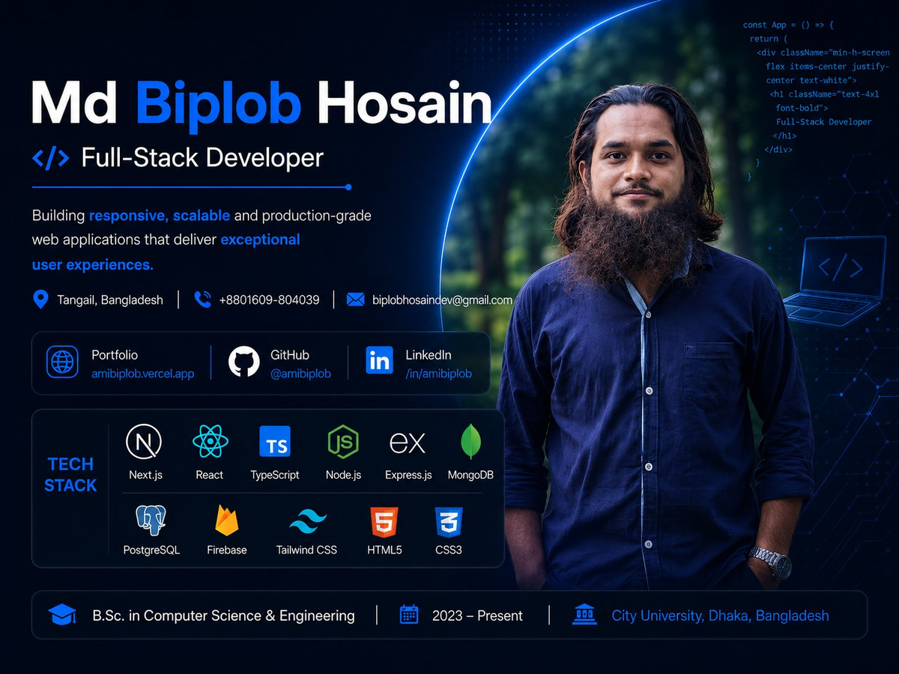

<div align="center">



<br/>


<a href="mailto:biplobhosaindev@gmail.com"></a>
<a href="https://amibiplob.vercel.app/"></a>
<a href="https://github.com/Amibiplob"></a>
<a href="https://www.linkedin.com/in/amibiplob/"></a>

</div>

---

## 👋 About Me

I'm a **self-taught Full-Stack Developer** from Bangladesh with **4 years of hands-on experience** building and shipping real web applications — from first lines of HTML/CSS in 2022 to production-grade **Next.js (App Router)** apps today. Every project I build goes live; I don't leave things sitting in a repo unfinished.

- 🎯 **Actively looking for work** — Frontend, React, Next.js, or Full-Stack roles
- ⚡ **Available immediately** — open to full-time, part-time, contract, or freelance
- 🏗️ **40+ public projects**, the majority deployed live on Vercel, Netlify, or Firebase
- 📈 Currently deepening **Next.js App Router**, **TypeScript**, and **SaaS-style architecture**
- 🎓 Studying **B.Sc. in Computer Science & Engineering** at City University, Dhaka
- 📬 Reach me at **biplobhosaindev@gmail.com**

> 🟢 **Hiring managers / recruiters:** I'm currently job hunting and would love to talk. Jump to [Let's Connect](#-lets-connect) below or just email me directly.

---

## 🛠️ Tech Stack

**Frontend**


**UI & Forms**


**Backend & Database**


**Tools & Deployment**


---

## 🚀 Featured Projects

> Selected projects that best show production-level depth — auth, real APIs, dashboards, and AI integration.

<table>
<tr>
<td width="50%">

### 🧠 Resume Analyzer AI
Full-stack AI-powered resume analyzer. Users upload resumes and get ATS compatibility scores with section-wise feedback, keyword gap analysis, tone detection, and AI-generated cover letters. Includes an admin dashboard (user/contact management, analytics) and a resume builder with live preview, templates, and PDF export.

**Stack:** Next.js, TypeScript, MongoDB, NextAuth.js, OpenRouter API, Tailwind CSS, shadcn/ui, Framer Motion, Zod

[🔗 Live](https://resume-analyzer-ai-pink.vercel.app) · [📦 Code](https://github.com/Amibiplob/Resume-Analyzer-AI)

</td>
<td width="50%">

### 🏆 Skill Judge — Team Project
A coding-challenge platform with a quiz section to test programming concepts and a community forum for programmers to learn from one another. Built collaboratively — server maintained on my account, client built with a teammate.

**Stack:** React, TypeScript, Tailwind CSS, Firebase, MongoDB, Express, JWT, React Hook Form, TanStack Query

[🔗 Server Live](https://skill-judge-server.vercel.app) · [📦 Server Code](https://github.com/Amibiplob/Skill-judge-server)

</td>
</tr>
<tr>
<td width="50%">

### 🛒 Soft-Buy
A full-stack e-commerce-style application built on the Next.js App Router with a component-driven UI architecture.

**Stack:** Next.js, TypeScript, Tailwind CSS

[🔗 Live](https://soft-buy.vercel.app) · [📦 Code](https://github.com/Amibiplob/Soft-Buy)

</td>
<td width="50%">

### ✅ ToDo PG
A todo app built to learn raw SQL with **PostgreSQL (Neon)** — no ORM. Covers NextAuth (JWT + Credentials), hashed passwords, user-scoped records, and Server Actions for CRUD.

**Stack:** Next.js, TypeScript, PostgreSQL (Neon), NextAuth v4, Tailwind CSS, shadcn/ui

[🔗 Live](https://to-do-pg.vercel.app) · [📦 Code](https://github.com/Amibiplob/ToDo-PG)

</td>
</tr>
</table>

---

## 📂 Other Projects

> Smaller and earlier projects — confirmed working and substantially complete.

| Project | Description | Stack | Links |
|---|---|---|---|
| **Smart Service** | Full-stack service booking platform | React, JavaScript | [Live](https://smart-service-five.vercel.app) · [Repo](https://github.com/Amibiplob/Smart-Service) |
| **Find App** | Search & discovery app with dynamic filtering | React, JavaScript | [Live](https://find-app-six.vercel.app) · [Repo](https://github.com/Amibiplob/Find-App) |
| **Item Cart** | E-commerce cart UI with product management | HTML, CSS, JavaScript | [Live](https://item-cart-two.vercel.app) · [Repo](https://github.com/Amibiplob/Item-Cart) |
| **Like New Phone** | Second-hand phone buy/sell marketplace with auth | React, Firebase | [Live](https://like-new-phone.web.app) · [Client](https://github.com/Amibiplob/like-new-phone-client) · [Server](https://github.com/Amibiplob/like-new-phone-server) |
| **Biplob IT** | Early learning project — programming course/info site | React, React Router | [Live](https://biplob-it.web.app) · [Repo](https://github.com/Amibiplob/biplob-it-client) |
| **Biplob Studio** | Early learning project — React + React Router practice | React, React Router | [Live](https://biplob-studio.web.app) · [Repo](https://github.com/Amibiplob/biplob-studio-client) |

<sub>The last two are early practice projects from when I was first learning React — kept public to show the starting point of the journey below.</sub>

---

## 📊 GitHub Stats

<div align="center">


</div>

<div align="center">


</div>

---

## 📈 Developer Journey

```text
Jul 2022   HTML, CSS, vanilla JavaScript — first 10 projects
Sep 2022   React — components, hooks, routing, Firebase auth
Dec 2022   Full-stack MERN — client + server pairs, REST APIs, MongoDB
Jan 2023   TypeScript — type safety across frontend and backend
Mid 2023   Advanced React patterns — context, custom hooks, optimization
2024–25    SaaS architecture
2025–26    PostgreSQL + raw SQL — ToDo PG, no-ORM database fundamentals
2026       Next.js App Router, AI integration — Resume Analyzer AI, Soft-Buy
```

---

## 🎓 Education

**B.Sc. in Computer Science & Engineering**
City University, Dhaka, Bangladesh · 2023 – Present

**Self-Taught Web Development**
Official docs, YouTube, and 40+ real shipped projects · 2022 – Present

---

## 💼 What I Bring to a Team

- ✅ **Ships real products** — every project is live, not just a repo
- ✅ **Full-stack capable** — frontend UI → backend API → database, end to end
- ✅ **Fast learner** — zero to Next.js + TypeScript + AI integration in under 4 years
- ✅ **Clean code habits** — consistent naming, separated concerns, reusable components
- ✅ **Available immediately** — ready to start right away

---

## 📬 Let's Connect

I'm actively looking for **Frontend**, **React**, **Next.js**, and **Full-Stack Developer** roles — full-time, part-time, contract, or freelance. If you're a recruiter or a team that needs someone who ships, I'd genuinely love to hear from you.

| | |
|---|---|
| 📧 Email | [biplobhosaindev@gmail.com](mailto:biplobhosaindev@gmail.com) |
| 🌐 Portfolio | [amibiplob.vercel.app](https://amibiplob.vercel.app/) |
| 💻 GitHub | [github.com/Amibiplob](https://github.com/Amibiplob) |
| 💼 LinkedIn | [linkedin.com/in/amibiplob](https://www.linkedin.com/in/amibiplob/) |
| 📱 Phone | +880 1609-804039 |

---

<div align="center">


*Open to full-time, part-time, and freelance opportunities — let's build something great together.*

</div>
